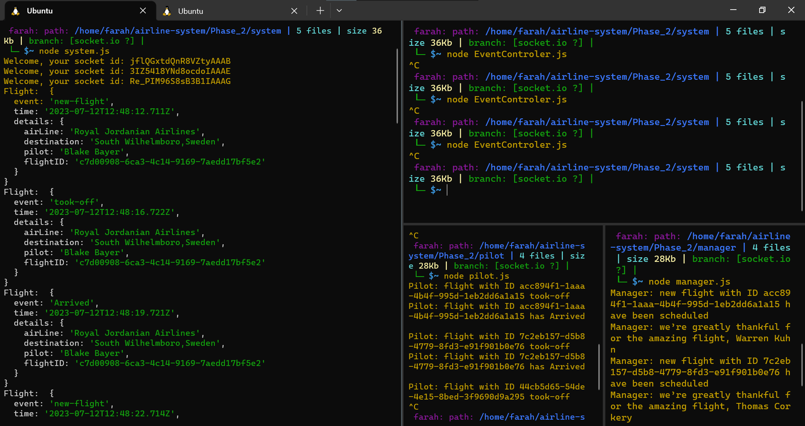
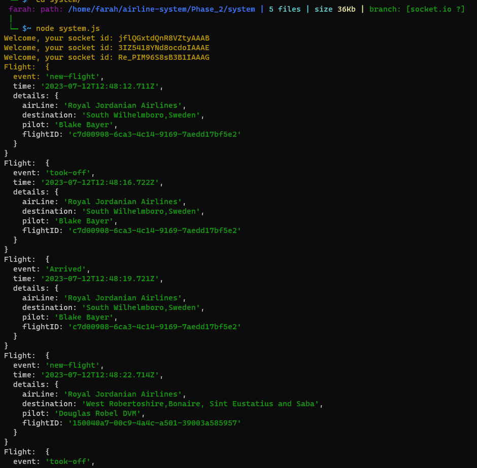
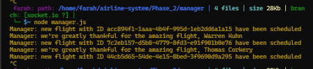
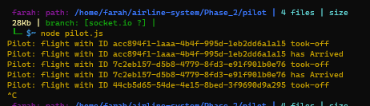

>>## lab 12 phase 2

>**Outputs**
>
>**system:**
>
>**manager:**
>
>**pilot:**
>

>### dependencies
>npm init -y
>npm i dotenv
>npm i socket.io-client
>npm i socket.io
>npm i uuid
>npm i npm install @faker-js/faker --save-dev
