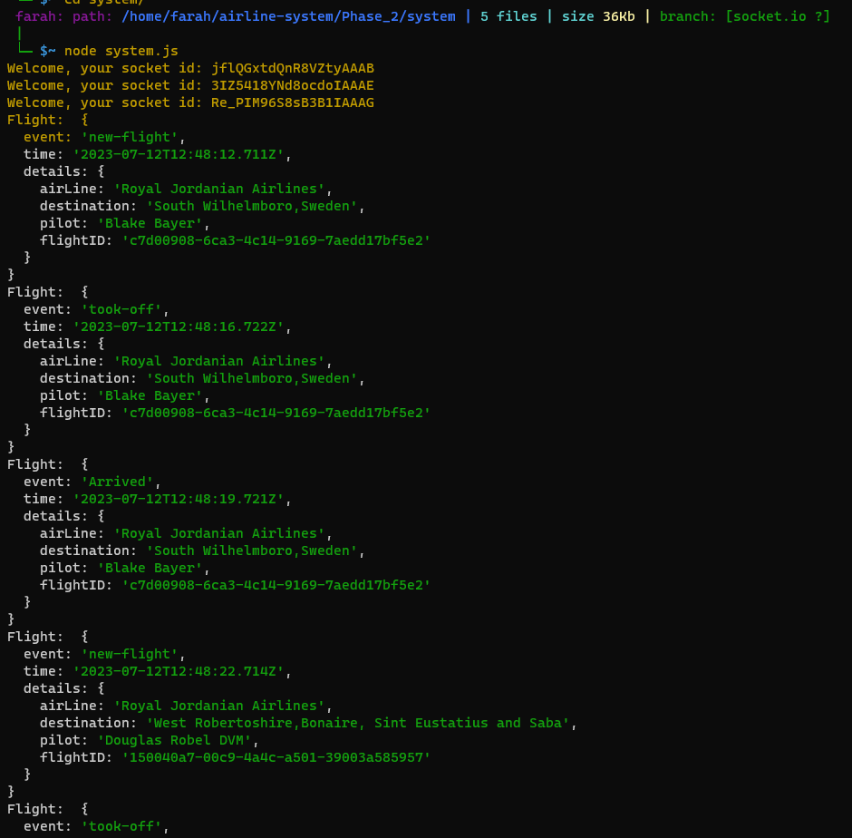

# airline-system
>## [lab11: phase1: Pull Request](https://github.com/FarrahYasin/airline-system/pull/1)
>## UML

>## outputs:

>

---
>

---
>

---

>## [lab12:phase2: Pull Request](https://github.com/FarrahYasin/airline-system/pull/2)
>>## outputs:

>**Outputs**
>

---

>**system:**
>

---

>**manager:**
>

---

>**pilot:**
>

---

>### dependencies
>npm init -y
>npm i dotenv
>npm i socket.io-client
>npm i socket.io
>npm i uuid
>npm i npm install @faker-js/faker --save-dev

---

>## [lab13:phase3: Pull Request](https://github.com/FarrahYasin/airline-system/pull/3)

